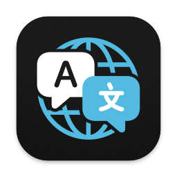

# Float Translator

> A simple translation app for macOS that floats over other apps.

## Features

- Runs as a menu bar application without showing an icon in the Dock;
- It remains floating over windows of other applications, even of applications that are in full screen;
- It can be displayed or hidden when necessary through a user-configurable keyboard shortcut;
- It can be configured to read and display the contents of the clipboard in the text field every time the application window is displayed;
- It can be configured to automatically translate the text copied to the clipboard whenever the window is displayed;
- The window is automatically dismissed when copying the translated text to the clipboard;
- Uses the native macOS translation service.

## Requirements

- Requires macOS 14 Sonoma or later.

## Contributing

Pull requests are welcome.

## License
[GNU General Public License](LICENSE)